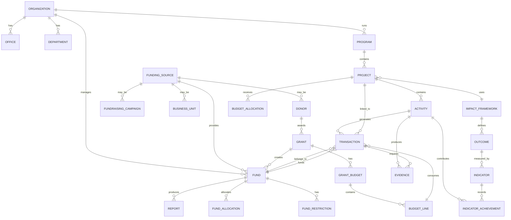

# Domain Model Fundara

Setuju. Untuk **Fundara — Mission Impact Platform**, domain model yang cocok sebaiknya tidak dimulai dari modul ERP seperti Accounting, Purchase, Sales, atau HR. Domain model harus dimulai dari **misi, dana, aktivitas, akuntabilitas, dan dampak**.

Saya sarankan kita memakai pendekatan:

> **Funding → Allocation → Mission Delivery → Accountability → Impact**

Atau dalam bahasa lebih naratif:

> Dana diterima sebagai amanah, dialokasikan ke misi, digunakan dalam aktivitas, dipertanggungjawabkan dengan bukti, lalu dihubungkan dengan dampak.

---

# 1. Inti domain Fundara

Domain utama Fundara bukan “accounting”. Accounting adalah salah satu mekanisme.

Domain inti Fundara adalah:

```text id="ywkfsk"
Trusted Fund → Mission Work → Measurable Impact
```

Maka domain model perlu menjawab lima pertanyaan besar:

| Pertanyaan | Domain |
|---|---|
| Dana berasal dari mana? | Funding Source |
| Dana masuk ke kantong apa? | Fund |
| Dana dialokasikan untuk apa? | Allocation, Program, Project, Activity |
| Dana digunakan bagaimana? | Transaction, Procurement, Advance, Expense |
| Apa bukti dan dampaknya? | Evidence, Report, Indicator, Outcome |

---

# 2. Bounded Context utama

Untuk project open source yang rapi, saya sarankan domain Fundara dibagi menjadi beberapa **bounded context**. Ini penting agar sistem tidak menjadi satu monolith konseptual yang sulit dipahami.

```text id="2d52c4"
Fundara Domain
├── Organization Context
├── Funding Context
├── Fund Stewardship Context
├── Mission Delivery Context
├── Financial Accountability Context
├── Procurement & Operations Context
├── Evidence & Compliance Context
├── Impact & Learning Context
└── Reporting Context
```

---

# 3. Domain Context 1 — Organization Context

Ini konteks tentang organisasi pengguna Fundara.

## Entitas utama

### Organization

Mewakili NGO, yayasan, komunitas, social enterprise, atau lembaga misi sosial.

Field konseptual:

- organization name
- legal entity
- registration number
- country
- base currency
- fiscal year
- organization type
- operating model
- status

### Office / Branch

Cabang atau lokasi operasional.

Contoh:

- Kantor Nasional
- Kantor Wilayah Jawa Barat
- Field Office Kupang
- Warehouse Medan

### Department / Unit

Unit kerja internal.

Contoh:

- Program
- Finance
- Operations
- Procurement
- Fundraising
- MEAL
- HR
- Social Enterprise Unit

### Cost Center

Struktur biaya organisasi.

Di ERPNext ini bisa memakai Cost Center. Dalam Fundara, cost center bukan pusat domain, tetapi tetap penting untuk laporan internal.

### User / Role

Aktor dalam sistem.

Contoh role:

- Executive Director
- Finance Manager
- Program Manager
- Project Officer
- Procurement Officer
- Field Staff
- Grant Manager
- Fundraising Officer
- MEAL Officer
- Auditor
- Board Viewer

## Relasi

```text id="onvd09"
Organization
 ├── has many Office
 ├── has many Department
 ├── has many Cost Center
 └── has many User / Role
```

---

# 4. Domain Context 2 — Funding Context

Ini menjawab: **uang atau sumber daya berasal dari mana?**

## Entitas utama

### Funding Source

Sumber pendanaan.

Jenis:

- institutional donor
- individual donor
- corporate donor
- public fundraising
- social enterprise revenue
- membership fee
- government contract
- zakat/infaq/wakaf, jika relevan
- internal reserve
- investment income
- service revenue

Field konseptual:

- source name
- source type
- contact
- restriction profile
- reporting expectation
- relationship owner
- active status

### Donor

Subjenis Funding Source, terutama untuk pemberi dana eksternal.

Jenis donor:

- institutional donor
- individual donor
- corporate donor
- philanthropic foundation
- government donor
- multilateral agency

### Fundraising Campaign

Campaign untuk mengumpulkan dana.

Contoh:

- Campaign Banjir 2026
- Beasiswa Anak Desa
- Emergency Medical Appeal
- Wakaf Klinik Komunitas
- End-of-Year Giving Campaign

Field penting:

- campaign name
- purpose
- target amount
- start date
- end date
- public message
- restricted/unrestricted
- campaign manager
- reporting requirement
- status

### Business Unit

Unit usaha atau social enterprise yang menghasilkan pendapatan.

Contoh:

- Training Center
- Café Sosial
- Konsultansi
- Produk Komunitas
- Merchandise
- Publishing Unit

Field penting:

- business unit name
- revenue model
- manager
- cost center
- tax profile
- surplus allocation policy
- status

## Relasi

```text id="ff2qoa"
Funding Source
 ├── may be Donor
 ├── may be Fundraising Campaign
 ├── may be Business Unit
 └── creates Fund
```

---

# 5. Domain Context 3 — Fund Stewardship Context

Ini jantung Fundara.

Konteks ini menjawab: **dana dikelola sebagai kantong amanah apa, dengan aturan apa?**

## Entitas utama

### Fund

Fund adalah “kantong dana” yang memiliki tujuan, batasan, periode, dan aturan penggunaan.

Jenis fund:

- Grant Fund
- Campaign Fund
- Unrestricted Fund
- Business Surplus Fund
- Reserve Fund
- Co-funding Fund
- Bridging Fund
- Endowment Fund
- Board-designated Fund

Field penting:

- fund name
- fund code
- fund type
- funding source
- restriction type
- purpose
- start date
- end date
- currency
- opening balance
- fund owner
- approval authority
- status

### Fund Restriction

Aturan penggunaan dana.

Jenis restriction:

- restricted
- temporarily restricted
- unrestricted
- board-designated
- donor-designated
- campaign-designated

Field penting:

- allowed cost
- disallowed cost
- allowed location
- allowed program
- allowed period
- procurement requirement
- reporting requirement
- approval exception rule

### Fund Allocation

Alokasi dana ke program, project, activity, atau budget line.

Contoh:

```text id="hy3jc9"
Fund: Campaign Banjir 2026
Allocated to: Emergency Response Project
Amount: Rp500.000.000
Purpose: Food package and hygiene kit
```

### Fund Transfer

Pemindahan antar fund secara internal.

Contoh:

- dari Unrestricted Fund ke Co-funding Fund
- dari Business Surplus Fund ke Program Fund
- dari Reserve Fund ke Emergency Fund

### Bridging Settlement

Penyelesaian dana talangan.

Contoh:

- biaya project dibayar dulu oleh Unrestricted Fund
- setelah grant cair, Unrestricted Fund diganti dari Grant Fund

## Relasi

```text id="4h9juf"
Fund
 ├── belongs to Funding Source
 ├── has Fund Restriction
 ├── has many Fund Allocation
 ├── has many Fund Transfer
 ├── funds Program / Project / Activity
 └── is used by Transactions
```

---

# 6. Domain Context 4 — Grant Context

Grant sebenarnya bisa dianggap sebagai subdomain dari Fund Stewardship, tetapi karena NGO sangat sering bergantung pada grant, saya sarankan Grant dibuat eksplisit.

## Entitas utama

### Grant

Kontrak pendanaan formal dari donor.

Field penting:

- grant name
- grant agreement number
- donor
- start date
- end date
- total amount
- currency
- implementation period
- reporting period
- grant manager
- finance focal point
- status

Status:

```text id="nf3lxa"
Pipeline → Awarded → Active → Extended → Closing → Closed
```

### Grant Budget

Budget yang disetujui donor.

### Grant Budget Line

Baris anggaran donor.

Contoh:

- Personnel
- Training
- Travel
- Equipment
- Sub-grant
- Monitoring & Evaluation
- Indirect Cost

### Grant Budget Version

Karena budget bisa direvisi, jangan overwrite budget lama.

Status budget:

```text id="509z2v"
Draft → Submitted → Approved → Active → Superseded
```

### Grant Reporting Schedule

Jadwal laporan donor.

Field:

- report type
- period start
- period end
- due date
- responsible person
- submission status

### Grant Compliance Rule

Aturan donor.

Contoh:

- minimum quotation
- eligible cost
- indirect cost rate
- prior approval threshold
- procurement threshold
- document retention rule
- branding requirement

## Relasi

```text id="usarep"
Donor
 └── has many Grant

Grant
 ├── creates one or more Fund
 ├── has Grant Budget
 ├── has many Budget Line
 ├── has Reporting Schedule
 ├── has Compliance Rule
 └── funds Project / Activity
```

---

# 7. Domain Context 5 — Mission Delivery Context

Ini menjawab: **organisasi melakukan pekerjaan misi apa?**

## Entitas utama

### Program

Area kerja strategis jangka menengah/panjang.

Contoh:

- Pendidikan
- Kesehatan
- Perlindungan Anak
- Lingkungan
- Pemberdayaan Ekonomi
- Respon Bencana

### Project

Unit implementasi yang punya tujuan, periode, budget, lokasi, dan manager.

Field:

- project name
- program
- project manager
- location
- start date
- end date
- linked fund/grant
- status
- target beneficiaries
- total budget

### Activity

Kegiatan nyata di lapangan atau operasional.

Contoh:

- Training guru
- Distribusi bantuan
- Field monitoring visit
- Community dialogue
- Survey baseline
- Workshop advokasi

Field:

- activity name
- project
- fund
- budget line
- location
- planned date
- actual date
- responsible person
- planned cost
- actual cost
- target output
- status

### Workplan

Rencana kerja per bulan/quarter/tahun.

### Deliverable

Output yang harus diserahkan.

Contoh:

- report
- training module
- policy brief
- dashboard
- dataset
- distribution completion
- audit package

## Relasi

```text id="ykj61g"
Program
 └── has many Project

Project
 ├── belongs to Program
 ├── funded by one or more Fund
 ├── has many Activity
 ├── has Workplan
 ├── has Deliverable
 └── has Budget Allocation

Activity
 ├── belongs to Project
 ├── uses Fund Allocation
 ├── creates Transaction
 ├── produces Evidence
 └── contributes to Indicator
```

---

# 8. Domain Context 6 — Financial Accountability Context

Ini menjawab: **bagaimana dana dipakai dan dicatat?**

## Entitas utama

### Budget

Rencana penggunaan dana.

Jenis:

- grant budget
- project budget
- activity budget
- organizational budget
- business unit budget
- campaign utilization budget

### Budget Line

Kategori budget sesuai kebutuhan fund/donor/program.

Jangan selalu disamakan dengan Chart of Accounts.

### Commitment

Komitmen biaya sebelum menjadi actual expense.

Contoh:

- approved purchase request
- purchase order
- signed contract
- approved travel request

### Expense

Biaya aktual.

### Payment

Pembayaran kas/bank.

### Cash Advance

Uang muka untuk staff/activity.

### Liquidation

Pertanggungjawaban uang muka.

### Reimbursement

Penggantian biaya yang sudah dibayar staff.

### Journal Allocation

Alokasi biaya antar project/fund/cost center.

### Fund Balance

Saldo fund berdasarkan income, transfer, commitment, actual, dan available balance.

## Relasi

```text id="89w5od"
Fund
 ├── has Budget
 ├── has Commitment
 ├── has Expense
 ├── has Payment
 └── has Balance

Budget Line
 ├── receives Allocation
 ├── consumed by Commitment
 └── consumed by Expense

Cash Advance
 ├── linked to Activity
 ├── linked to Fund
 └── closed by Liquidation
```

## Konsep angka penting

Fundara perlu membedakan:

| Konsep | Makna |
|---|---|
| Approved Budget | Anggaran yang disetujui |
| Revised Budget | Anggaran setelah revisi |
| Allocated Budget | Dana yang dialokasikan ke project/activity |
| Committed Amount | Dana yang sudah dijanjikan/diikat |
| Actual Amount | Dana yang sudah menjadi biaya aktual |
| Paid Amount | Dana yang sudah dibayar |
| Available Balance | Sisa dana yang dapat digunakan |
| Forecast Amount | Perkiraan penggunaan sampai akhir periode |

---

# 9. Domain Context 7 — Procurement & Operations Context

Ini menjawab: **bagaimana kebutuhan operasional dipenuhi secara akuntabel?**

## Entitas utama

### Purchase Request

Permintaan pembelian.

### Supplier / Vendor

Penyedia barang/jasa.

### Quotation

Penawaran vendor.

### Bid Analysis

Perbandingan penawaran.

### Purchase Order

Pesanan resmi.

### Goods Receipt / Service Acceptance

Penerimaan barang atau konfirmasi jasa.

### Purchase Invoice

Tagihan vendor.

### Asset

Aset yang dibeli.

### Inventory Item

Barang stok.

### Warehouse / Storage Location

Lokasi penyimpanan.

### Travel Request

Permintaan perjalanan.

### Vehicle Request

Permintaan kendaraan.

## Relasi

```text id="2bnpiv"
Activity
 └── creates Purchase Request

Purchase Request
 ├── uses Fund
 ├── consumes Budget Line
 ├── follows Procurement Rule
 ├── may require Quotation
 ├── may create Purchase Order
 └── may create Commitment

Purchase Order
 ├── creates Commitment
 ├── followed by Goods Receipt
 ├── followed by Purchase Invoice
 └── becomes Actual Expense
```

---

# 10. Domain Context 8 — Evidence & Compliance Context

Ini menjawab: **apa bukti bahwa dana digunakan benar?**

## Entitas utama

### Evidence

Bukti pendukung.

Jenis:

- invoice
- receipt
- attendance list
- photo
- contract
- quotation
- bid analysis
- delivery note
- service acceptance
- training report
- field report
- beneficiary list
- payment proof
- approval memo

### Evidence Requirement

Daftar bukti yang wajib berdasarkan jenis transaksi, fund, donor, amount, atau activity.

Contoh:

```text id="y6ij74"
Jika activity type = Training:
- attendance list wajib
- foto kegiatan wajib
- training report wajib
- invoice venue wajib jika ada biaya venue
```

### Compliance Rule

Aturan yang harus dipenuhi.

### Compliance Check

Hasil pemeriksaan otomatis/manual.

### Audit Trail

Jejak perubahan dan approval.

### Exception

Pengecualian yang perlu justifikasi dan approval khusus.

## Relasi

```text id="jpuay6"
Transaction
 ├── requires Evidence
 ├── checked by Compliance Rule
 ├── may create Exception
 └── included in Audit Pack

Fund
 ├── defines Compliance Rule
 └── defines Evidence Requirement
```

---

# 11. Domain Context 9 — Impact & Learning Context

Ini menjawab: **apa hasil dari kerja misi?**

## Entitas utama

### Impact Framework

Kerangka dampak organisasi.

### Outcome

Perubahan yang ingin dicapai.

Contoh:

- peningkatan akses pendidikan
- peningkatan pendapatan keluarga
- penurunan risiko kekerasan
- peningkatan ketahanan komunitas

### Output

Hasil langsung aktivitas.

Contoh:

- 100 guru dilatih
- 500 paket bantuan didistribusikan
- 10 desa didampingi
- 1 policy brief diterbitkan

### Indicator

Ukuran capaian.

Field:

- indicator name
- type: output/outcome/impact
- unit
- baseline
- target
- disaggregation
- frequency
- data source

### Indicator Achievement

Capaian aktual.

### Beneficiary / Participant

Penerima manfaat atau peserta kegiatan.

Perlu hati-hati dengan privacy.

### Feedback / Complaint

Mekanisme akuntabilitas kepada komunitas.

## Relasi

```text id="xmbwj4"
Program
 └── has Impact Framework

Project
 ├── contributes to Outcome
 ├── has Indicator
 └── reaches Beneficiary Group

Activity
 ├── produces Output
 ├── records Indicator Achievement
 └── collects Evidence
```

---

# 12. Domain Context 10 — Reporting Context

Ini menjawab: **bagaimana pertanggungjawaban disajikan?**

## Entitas utama

### Report

Laporan umum.

Jenis:

- donor report
- campaign report
- fund utilization report
- board report
- management report
- public impact report
- audit pack
- business unit P&L
- project progress report

### Report Template

Format laporan.

### Reporting Period

Periode laporan.

### Report Submission

Status pengiriman laporan.

### Supporting Document Register

Daftar bukti pendukung.

### Audit Pack

Paket dokumen untuk audit.

## Relasi

```text id="b8tt0q"
Report
 ├── generated from Fund
 ├── generated from Project
 ├── generated from Activity
 ├── generated from Transaction
 ├── includes Evidence
 └── includes Impact Indicator
```

---

# 13. Model relasi besar Fundara

Secara high-level:

```text id="1lrcob"
Organization
 ├── owns Program
 ├── owns Fund
 ├── runs Project
 └── records Transaction

Funding Source
 ├── provides Fund
 ├── may be Donor
 ├── may be Campaign
 └── may be Business Unit

Fund
 ├── has Restriction
 ├── has Budget
 ├── has Allocation
 ├── funds Project
 ├── funds Activity
 ├── records Transaction
 └── produces Fund Report

Program
 ├── contains Project
 └── defines Impact Framework

Project
 ├── contains Activity
 ├── uses Fund Allocation
 ├── creates Procurement
 ├── creates Expense
 ├── produces Evidence
 └── contributes to Impact

Transaction
 ├── belongs to Fund
 ├── belongs to Project / Activity
 ├── consumes Budget Line
 ├── creates Accounting Entry
 ├── requires Evidence
 └── appears in Report

Impact
 ├── linked to Program
 ├── linked to Project
 ├── linked to Activity
 └── reported to Stakeholder
```

---

# 14. Aggregate Root yang disarankan

Kalau kita berpikir secara Domain-Driven Design, beberapa aggregate root utama:

## 1. Fund

Fund adalah aggregate root untuk:

- restriction
- balance
- allocation
- fund transfer
- fund utilization
- fund report

## 2. Grant

Grant adalah aggregate root untuk:

- grant budget
- grant reporting schedule
- donor compliance rule
- amendment
- closeout

## 3. Project

Project adalah aggregate root untuk:

- activity
- workplan
- deliverable
- project budget
- project indicator

## 4. Activity

Activity bisa menjadi aggregate root untuk:

- field report
- attendance
- output
- evidence
- activity expense

## 5. Transaction

Transaction adalah aggregate root untuk:

- payment status
- supporting document
- compliance check
- approval trail

## 6. Report

Report adalah aggregate root untuk:

- report period
- report lines
- review status
- submission record
- attachments

---

# 15. Universal tagging / accounting dimensions

Agar Fundara bisa berjalan di atas ERPNext, kita perlu menentukan dimensi universal.

Saya sarankan minimal:

| Dimensi | Wajib? | Fungsi |
|---|---:|---|
| Fund | Ya | Menentukan sumber/kantong dana |
| Project | Ya untuk project expense | Menentukan konteks implementasi |
| Activity | Opsional tapi penting | Menentukan kegiatan spesifik |
| Budget Line | Ya untuk kontrol budget | Menentukan kategori budget donor/fund |
| Cost Center | Ya | Menentukan unit biaya organisasi |
| Location | Opsional | Menentukan wilayah/lokasi |
| Funding Source | Turunan dari Fund | Untuk laporan sumber dana |
| Donor / Campaign / Business Unit | Conditional | Muncul sesuai jenis fund |
| Reporting Period | Conditional | Penting untuk donor/campaign report |

Prinsipnya:

> Setiap transaksi harus tahu minimal: **Fund, Project/Cost Center, Budget Line, dan Evidence Requirement**.

---

# 16. Status lifecycle penting

## Fund lifecycle

```text id="vwxkey"
Draft → Active → Suspended → Closing → Closed
```

## Grant lifecycle

```text id="u4kwlb"
Pipeline → Awarded → Active → Extended → Closing → Closed
```

## Project lifecycle

```text id="jg5r0r"
Concept → Approved → Active → On Hold → Completed → Closed
```

## Activity lifecycle

```text id="dqooan"
Planned → Approved → In Progress → Completed → Reported → Verified → Closed
```

## Budget lifecycle

```text id="rchvbr"
Draft → Submitted → Approved → Active → Revised → Closed
```

## Transaction lifecycle

```text id="ebcsr2"
Draft → Submitted → Reviewed → Approved → Posted → Paid → Reconciled → Reported
```

## Cash advance lifecycle

```text id="5hfr8x"
Requested → Approved → Paid → Pending Liquidation → Liquidation Submitted → Reviewed → Closed
```

## Report lifecycle

```text id="9j30q1"
Draft → Generated → Reviewed → Approved → Submitted → Archived
```

---

# 17. MVP domain model

Untuk MVP, jangan semua domain langsung dibangun. Saya sarankan domain minimal:

```text id="q9reeh"
Organization
Funding Source
Fund
Fund Restriction
Project
Activity
Budget Line
Budget Allocation
Expense Request
Cash Advance
Liquidation
Transaction
Evidence
Fund Utilization Report
```

MVP harus bisa menjawab:

1. Dana ini berasal dari mana?
2. Dana ini masuk fund apa?
3. Fund ini restricted atau unrestricted?
4. Fund ini dialokasikan ke project/activity mana?
5. Budget line-nya apa?
6. Sudah committed berapa?
7. Sudah actual berapa?
8. Sisa available berapa?
9. Bukti transaksi lengkap atau belum?
10. Dampak/activity apa yang dihasilkan?

---

# 18. Domain model versi Mermaid

Untuk dokumentasi teknis, kita bisa tulis seperti ini:



---

# 19. Rekomendasi nama file dokumen

Untuk dokumentasi project open source, domain model ini bisa kita pecah menjadi:

```text id="jexpf5"
docs/
├── domain/
│   ├── README.md
│   ├── domain-model.md
│   ├── bounded-contexts.md
│   ├── fund-domain.md
│   ├── grant-domain.md
│   ├── mission-delivery-domain.md
│   ├── accountability-domain.md
│   ├── impact-domain.md
│   └── reporting-domain.md
```

Atau untuk awal cukup satu file:

```text id="sm7523"
DOMAIN_MODEL.md
```

---

# 20. Rekomendasi keputusan awal

Menurut saya, keputusan domain paling penting adalah:

## Fund harus menjadi pusat

Bukan donor, bukan project, bukan accounting account.

Karena Fundara harus bisa menangani:

- grant donor
- donasi publik
- campaign restricted
- unrestricted fund
- business surplus
- reserve
- bridging fund
- co-funding

Maka entitas paling fundamental adalah:

```text id="9dt59j"
Fund
```

## Project adalah tempat dana bekerja

Project dan Activity adalah konteks implementasi.

```text id="drsdq4"
Fund → Project → Activity
```

## Transaction harus membawa konteks misi

Transaksi tidak boleh hanya debit/kredit.

```text id="l32m0t"
Transaction = Financial Event + Mission Context + Evidence + Accountability
```

## Impact harus terhubung ke Activity

Dampak tidak berdiri sendiri.

```text id="wxy6qy"
Fund → Activity → Output → Outcome → Impact
```

---

Kesimpulan awal saya:

> Domain model Fundara sebaiknya berpusat pada **Fund**, lalu menghubungkan Fund ke **Project, Activity, Transaction, Evidence, Report, dan Impact Indicator**.

Dengan begitu Fundara benar-benar menjadi **Mission Impact Platform**, bukan hanya accounting system dengan label NGO.
